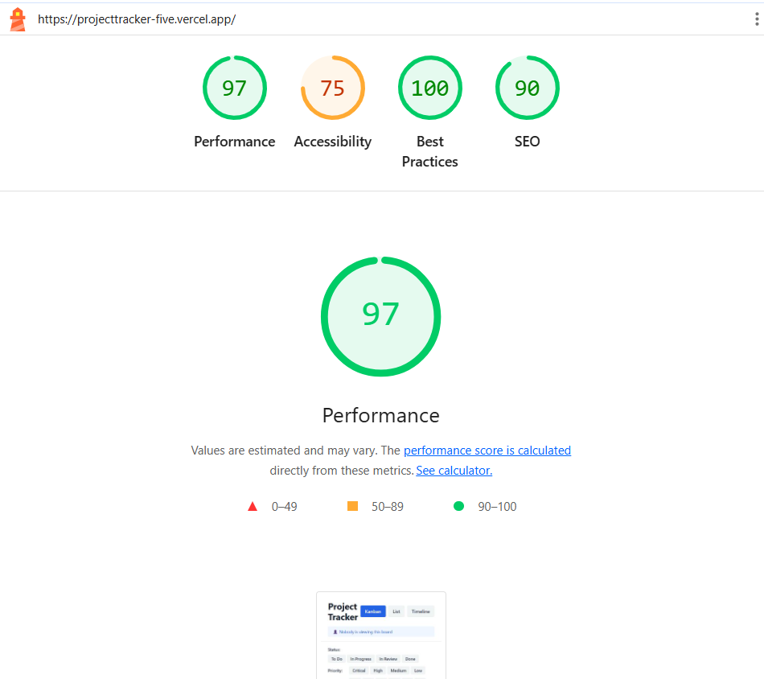

# Project Tracker - Multi-View Task Management UI

A high-performance project management application with three synchronized views custom drag-and-drop, virtual scrolling, and live collaboration features. Built using React, TypeScript, and Tailwind CSS.

---

## 🌐 Live Demo

🔗 https://projecttracker-five.vercel.app/

---

## ✨ Features

### 📊 Three Synchronized Views
- **Kanban Board** - Organize tasks into 4 columns (To Do, In Progress, In Review, Done)
- **List View** - Sortable table with virtual scrolling for 500+ tasks
- **Timeline View** - Gantt chart visualization with drag-based layout
- Instant switching between views with no data re-fetch

### 🎯 Custom Drag-and-Drop System
- **No external libraries** - Pure pointer event implementation
- Mouse and touch support
- Drag ghost animation with opacity feedback
- Drop zone highlighting
- Smart snapback for invalid drops
- Placeholder preservation during drag

### ⚡ Virtual Scrolling
- Only renders visible rows + 5-row buffer
- Handles 500+ tasks without performance degradation
- Smooth scrolling with no flicker or gaps
- Correct scrollbar sizing maintained

### 🤝 Live Collaboration Indicators
- Simulated multi-user presence
- Real-time avatar display on viewed tasks
- Top bar showing active viewers
- Automatic user movement animation

### 🔍 Advanced Filtering
- Multi-select filters - Status, Priority, Assignee, Due Date
- Instant filtering (no submit button)
- URL-synced state for bookmarking & sharing
- Back-navigation support

---

## 🛠 Tech Stack

- **React 18** with TypeScript
- **Zustand** for state management
- **Tailwind CSS** for styling
- **React Router DOM** for URL sync
- **Date-fns** for date manipulation
- **Vite** for build tooling

### No External Libraries Used For
- ✋ Drag-and-drop (custom pointer events)
- 📜 Virtual scrolling (custom calculations)
- 🎨 UI components (all custom built)

---

## 📈 Performance

- **Performance:** 97  
- **Accessibility:** 75  
- **Best Practices:** 100  
- **SEO:** 90  



---

## 🚀 Getting Started

### Prerequisites
- Node.js 16+ & npm

### Installation

```bash
git clone https://github.com/RACHITALAAD/Multi-ViewProjectTracker.git

cd project

npm install

npm run dev
```

## ⚙️ Setup Instructions

1. Clone the repository  
2. Install dependencies using `npm install` 
3. Run development server using `npm run dev`
4. Build the project using `npm run build`

---

## 🧠 State Management Decision

Zustand was chosen for its simplicity and minimal boilerplate compared to Redux. It allows efficient global state sharing across multiple views without prop drilling. It is especially useful for managing drag-and-drop state, filters, and collaboration indicators while keeping the codebase clean and maintainable.

---

## ⚡ Virtual Scrolling Approach

Virtual scrolling is implemented by calculating visible items based on scroll position and rendering only those elements along with a small buffer. The overall container height is preserved to maintain correct scrollbar behavior. This reduces DOM nodes significantly and ensures smooth performance even with large datasets.

---

## 🎯 Drag-and-Drop Approach

Drag-and-drop is implemented using native pointer events without external libraries. A floating drag element is rendered while dragging, and drop zones are detected using pointer position. A placeholder element is used to preserve layout structure and invalid drops trigger a smooth snapback animation.

---